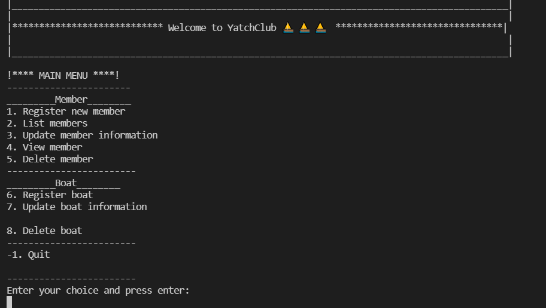
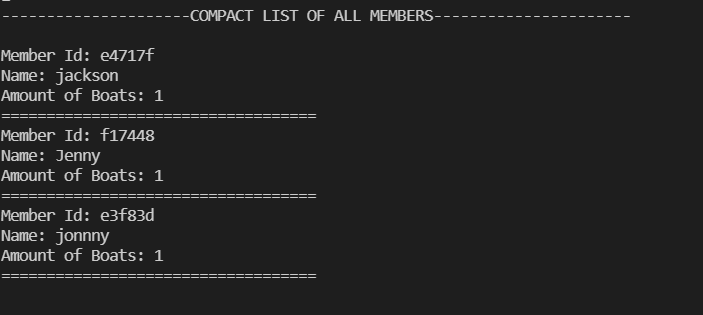
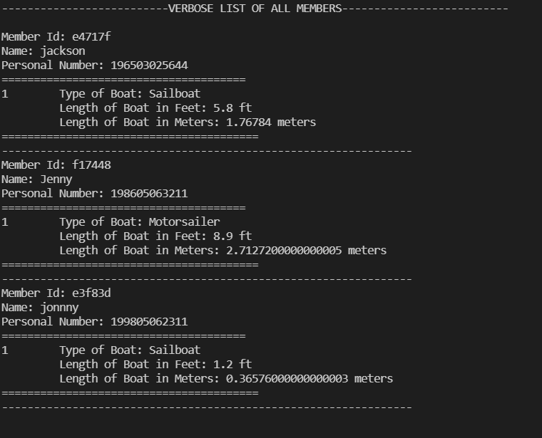

# A2

## YatchClub Apps
- This is a console apps which can be used to create/register, read/retrieve, update and delete member's information including their owned boats. 

- Run this apps with 
`./gradlew run -q --console=plain`

- The main menu of this apps will look like below

The main menu contains 2 small menu: one for member and one for boat. 
+ In member menu, there has 5 options to work with member data (create - 1, list - 2, view/look for - 3, update -4 and delete - 5). The new member is registered with name and personal number. Check the [design](./design.md) for sequence diagram. ListMember will show all members with 2 types of list (compact and verbose list). 

+ In boat menu, there has 3 options (register - 6, update - 7, delete - 8). When user choose to register a boat the compact list of all members will be show so the user can check and give the right memberId/owner for the registered boat. It is the same process for update and delete boat. User need to provide right memberId and boatId to work with the boat. With wrong input, the InvalidInput exception will be throwed and the same for MemberNotFound and BoatNotFound exception. To quit from apps , user can type -1.

+ All data will be save and change in MemberData.json with the use of Jackson 2.13 library.

+ The final class diagram can be found in [design](./design.md)
