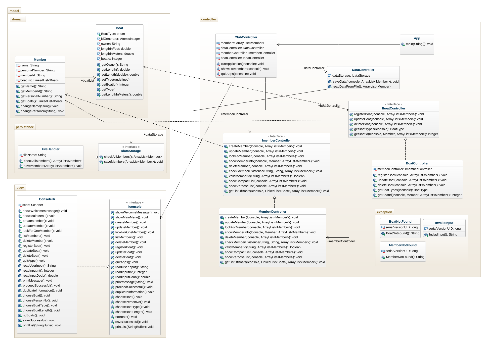
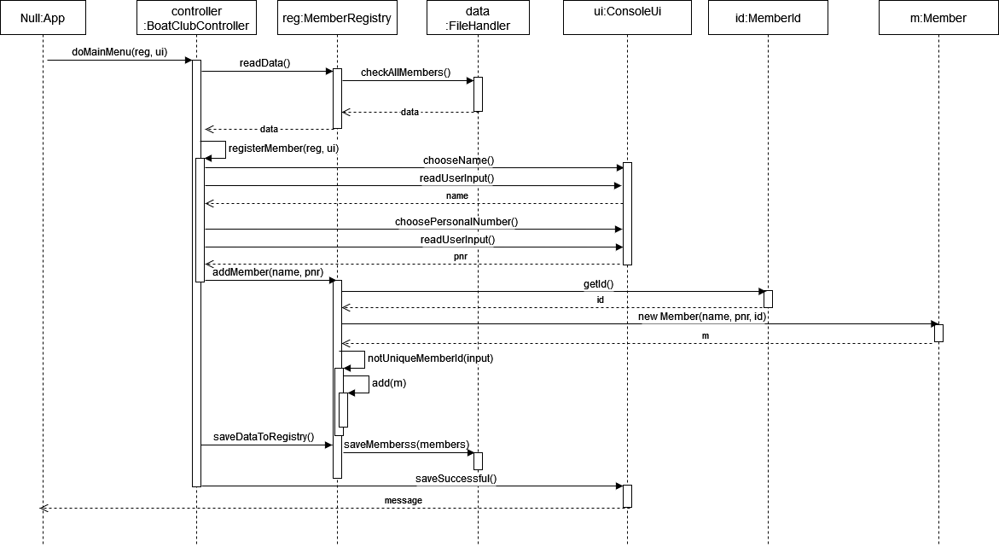

# Boatclub OO-Design
This document describes the design according to the requirements presented in assignment 2.

## Architectural Overview
The application uses the model-view-controller (MVC) architectural pattern. The view is passive and gets called from the controller. The view may only read information from the model, not directly change it.

## Detailed Design
### Class Diagram
The final class diagram for the app.

### Sequence Diagram
The sequence diagram for the scenario when a new member is created/registered.

